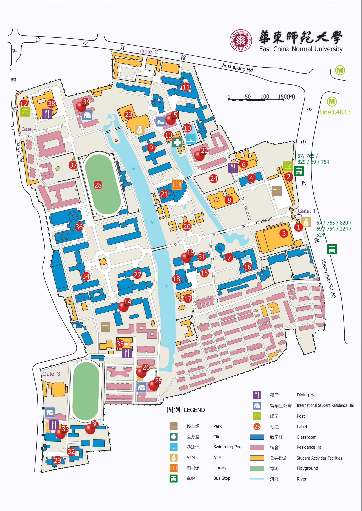
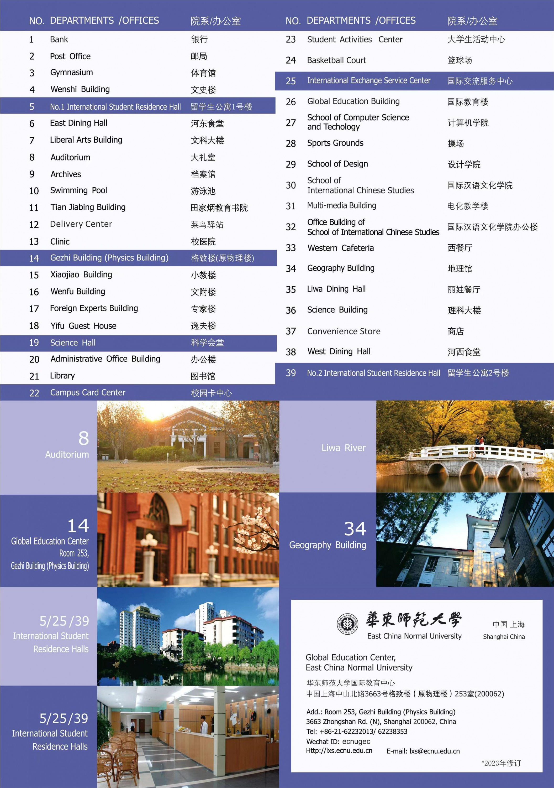

# Tips for traveling in China

## About Shanghai and China in general

Shanghai is a coastal municipality in eastern China, sitting at the mouth of the Yangtze River on the East China Sea. About 25 million people live here, making it China’s largest city. Mandarin is the official language, but locals speak the Wu-dialect Shanghainese; English signage is common on the metro, in airports (Pudong – PVG and Hongqiao – SHA) and in most tourist areas. The city has a humid-subtropical climate: hot, wet summers (30–35 °C, risk of typhoons July-September) and cool, damp winters that rarely drop below 0 °C. Shanghai borders Jiangsu and Zhejiang provinces and is linked to the rest of the country by high-speed rail.

Shanghai is China’s main financial centre and the world’s busiest container port, so paperwork, import/export and tech services are well developed. Living costs are high for China but moderate compared with Moscow. Mobile payments (Alipay, WeChat Pay) dominate; Russian bank cards issued on Visa/Mastercard may work only in a few hotels, so plan for cash or a UnionPay/Мир-UnionPay card. Public security is tight and violent crime is rare, though petty scams around tourist spots exist.

China’s primary messaging platform is **WeChat**, which works much like Telegram or WhatsApp. **We strongly recommend installing it** before your trip. [WeChat on the App Store](https://apps.apple.com/ru/app/wechat/id414478124?l=en-GB), [WeChat on Google Play](https://play.google.com/store/apps/details?id=com.tencent.mm&hl=en&pli=1). 

## Summer Institute Venue

Our Summer Institute will take place at **3663 Zhongshan North Road, Putuo District, Shanghai 200062, China** (Chinese: **上海市普陀区中山北路 3663 号**).

  
📷 The location on the map

  

  
📷 Scheme of the campus

  

  
📷 Departments and their locations

  

## Additional information
- [Payment](payment.md)
- [Transfer](transfer.md)
- [Weather](weather.md)
- [Food](food.md)
- [Internet/VPN](internet.md)