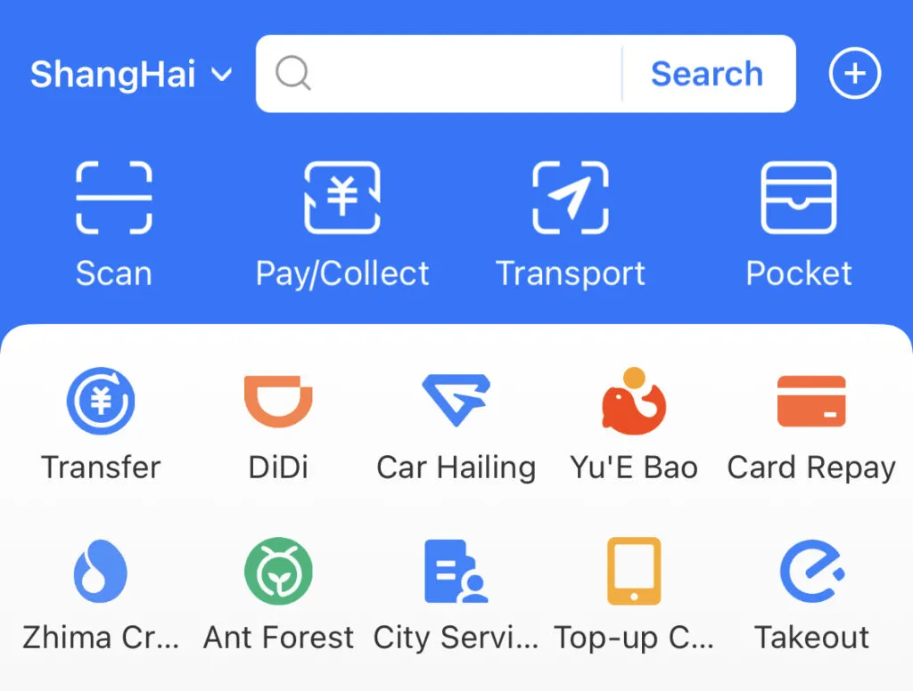

# Payment in Shanghai

Shanghai now runs mostly on QR-code payments: roughly 90% of in-store transactions go through mobile wallets, with cash and plastic kept as fallbacks. A 2024 directive obliges every merchant to accept renminbi notes, so cash is rarely refused even in corner shops.

**We recommend to install both Alipay and WeChat Pay**. After a quick passport check you can link most Visa, Mastercard or UnionPay credit cards—no Chinese bank account required. Charges settle in CNY, the wallet adds a 3–5% FX fee, and single payments with foreign cards are capped at about ¥6 000. Peer-to-peer transfers and wallet top-ups stay locked unless you open a local account.

Alipay and WeChat Pay are full "super-apps": besides payments and messaging they bundle ride-hailing, high-speed-rail tickets, public-transport QR codes, food delivery and many other mini-services, so separate local apps are rarely needed.

Most POS terminals accept contactless or mag-stripe Visa/Mastercard/UnionPay cards issued outside Russia. Russian cards often fail: Gazprombank’s UnionPay cards stopped working in 2024, and Rosselkhozbank cards function only sporadically and with limits. Hotels, metro ticket machines, chain stores and hospitals usually take foreign cards, but small vendors may show only a UnionPay QR, carry at least one wallet app or some cash for those cases.

## How to top-up Alipay without a foreign bank card

Alipay can be used in two ways: (1) by linking an unsanctioned Visa, Mastercard or UnionPay card, or (2) by loading funds into the wallet balance. If you are travelling from Russia and do not have an eligible foreign card, focus on the balance top-up route. The practical methods change frequently (third-party exchangers, P2P transfers from contacts in China, cash deposits via partners, etc), so check the latest [step-by-step](https://dtf.ru/howto/3446118-kak-popolnit-alipay-iz-rossii-v-2025-godu-nadezhnye-sposoby-i-detalnaya-instrukciya) guide *(in Russian)* before you fly. 
